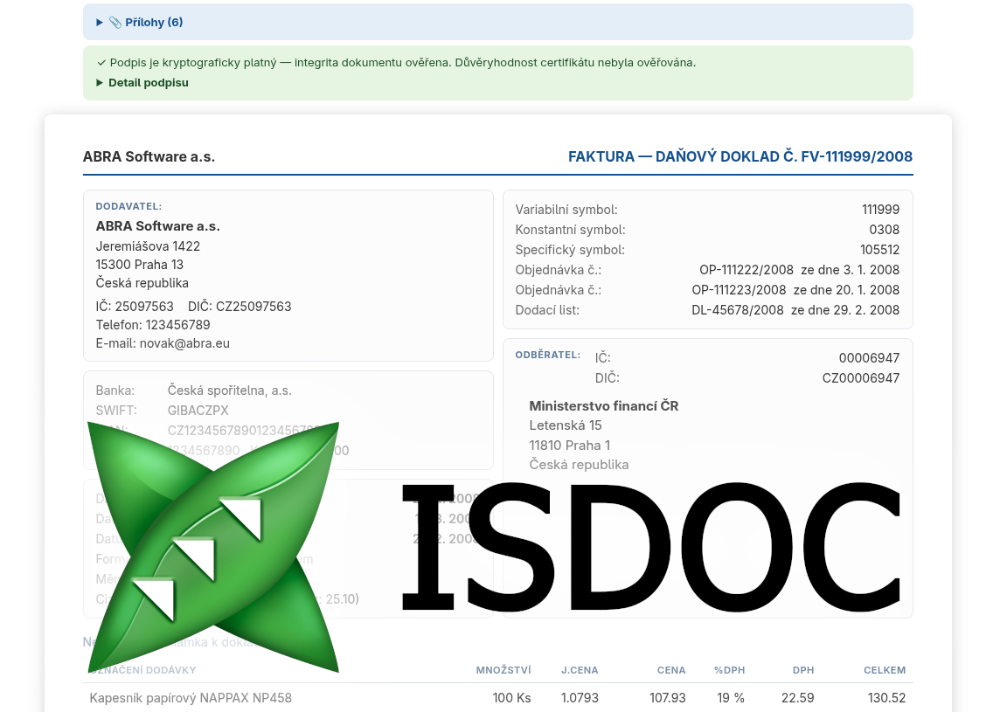

<!--
  - SPDX-FileCopyrightText: 2026 Synetix <jelinek@synetix.cz>
  - SPDX-License-Identifier: AGPL-3.0-or-later
-->
# ISDOC Viewer pro Nextcloud (`files_isdoc`)

Náhled českých e-faktur ve formátu **ISDOC** (`.isdoc`, `.isdocx`) přímo v Nextcloud Vieweru. Po kliknutí na soubor se faktura zobrazí jako čitelný doklad namísto syrového XML.

*Preview of Czech ISDOC e-invoices (`.isdoc`, `.isdocx`) directly in the Nextcloud Viewer.*



## Vlastnosti

- Podpora **ISDOC 6.x** i starších dokumentů 5.x.
- Podpora kontejneru **`.isdocx`** (ZIP) včetně **příloh** — stažení, otevření bezpečných typů (PDF, obrázky), ověření otisku vůči dokladu.
- **Věrné zobrazení** — částky se nikdy nedopočítávají ani nepřeformátovávají.
- **Validace dokladu**: kontrola struktury a kontrolní součty (položky a rekapitulace DPH vs. deklarované součty) zobrazené v pruzích nad dokladem a jako ✓/⚠ u součtů.
- **Elektronický podpis**: kryptografické ověření integrity dokumentu přímo v prohlížeči + detail podepisujícího certifikátu. Důvěryhodnost certifikátu (řetěz k autoritě, odvolání) se neověřuje.
- Automatická registrace MIME typů při instalaci, česká a anglická lokalizace, datumy dle locale uživatele.

## Požadavky

- Nextcloud 32–33 s povolenou aplikací **Viewer** (součást standardní instalace)

## Instalace

**Z App Store** (až bude publikováno): Aplikace → vyhledat „ISDOC Viewer" → Stáhnout a povolit.

**Ručně ze zdrojových kódů:**

```bash
cd /path/to/nextcloud/apps
git clone https://github.com/synetix-code/files_isdoc.git
cd files_isdoc
npm ci && npm run build

# jako uživatel webserveru, z kořene instalace Nextcloudu:
php occ app:enable files_isdoc
php occ maintenance:mimetype:update-js   # obnoví ikony typů souborů
```

## MIME typy

O vše se postará instalační krok při `occ app:enable`: přidá mapování `isdoc` → `application/isdoc+xml` a `isdocx` → `application/isdocx` do `config/mimetypemapping.json` (a ikony do `mimetypealiases.json`), zaregistruje typy v databázi a přemapuje i už nahrané soubory. Cizí záznamy nikdy nepřepisuje; při odinstalaci své záznamy zase odebere.

Pokud by krok nemohl zapsat do `config/` (práva), vypíše varování — pak přidejte záznamy ručně a spusťte:

```bash
php occ maintenance:mimetype:update-db --repair-filecache
php occ maintenance:mimetype:update-js
```

## Vývoj

```bash
npm ci
npm run watch        # průběžný development build
npm run appstore     # release tarball do build/files_isdoc.tar.gz
```

Frontend: Vue 2.7 + Vite (`@nextcloud/vite-config` v1.x — musí zůstat na řadě v1, Viewer běží na Vue 2.7). Backend: PHP, integrace přes event `OCA\Viewer\Event\LoadViewer`. Testovací faktury jsou v `tests/fixtures/` (oficiální vzorky z [isdoc/isdoc2ubl](https://github.com/isdoc/isdoc2ubl), Apache-2.0).

Release pro App Store je třeba podepsat certifikátem z [registrace aplikace](https://apps.nextcloud.com/developer/apps/releases/new); postup popisuje [dokumentace App Store](https://nextcloudappstore.readthedocs.io/en/latest/developer.html).

## Zdroje / Resources

- Specifikace ISDOC: https://isdoc.cz ([6.0.2](https://isdoc.cz/6.0.2/doc/isdoc.html)); správcem formátu je Ministerstvo vnitra ČR
- Oficiální GitHub organizace ISDOC: https://github.com/isdoc — [schema](https://github.com/isdoc/schema) (XSD), [isdoc2ubl](https://github.com/isdoc/isdoc2ubl) (konverze do UBL + vzorové faktury), [isdoc.pdf](https://github.com/isdoc/isdoc.pdf) (PDF s vloženým XML; zatím nepodporováno)
- Nextcloud Viewer API: https://github.com/nextcloud/viewer

Logo ISDOC je ochranná známka Ministerstva vnitra ČR.

## Licence

[AGPL-3.0-or-later](LICENSES/AGPL-3.0-or-later.txt)
